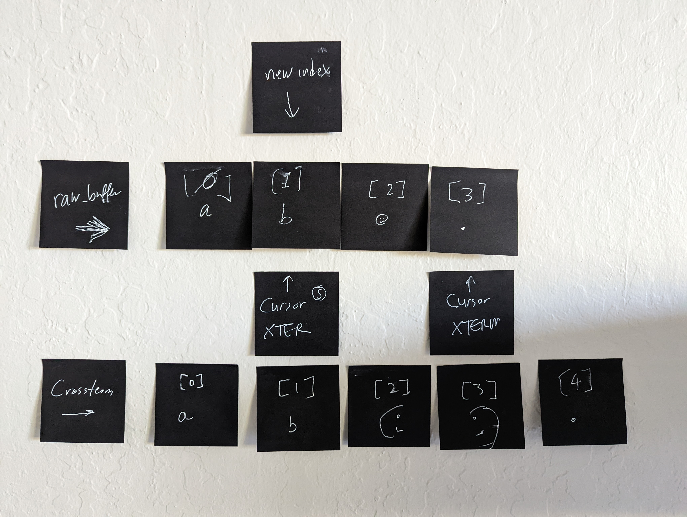

# graphemes

<!-- TOC depthfrom:2 orderedlist:false -->

- [What this crate does](#what-this-crate-does)
- [Learnings about grapheme clusters](#learnings-about-grapheme-clusters)
- [A possible solution from reedline crate](#a-possible-solution-from-reedline-crate)

<!-- /TOC -->

## What this crate does

This app simply:

1. prints out a list of graphemes using the `seshat-unicode` and `unicode-segmentation` crates
2. uses `unicode-width` to calculate the display widths of unicode strings

Here is a screenshot from MacOS Monterey (Terminal.app)


Here is a screenshot from PopOS 22.10 (Tilix) 

## Learnings about grapheme clusters

A grapheme cluster is a user-perceived character. Rust uses `UTF-8` to represent text in `String`.
So each character takes up 8 bits or one byte. Grapheme clusters can take up many more bytes, eg 4
bytes or 2 or 3, etc.

Docs:

- [Grapheme clusters](https://medium.com/flutter-community/working-with-unicode-and-grapheme-clusters-in-dart-b054faab5705):
- [UTF-8 String](https://doc.rust-lang.org/book/ch08-02-strings.html)

There is a discrepancy between how a `String` that contains grapheme clusters is represented in
memory and how it is rendered in a terminal. When writing an TUI editor it is necessary to have a
"logical" cursor that the user can move by pressing up, down, left, right, etc. For left, this is
assumed to move the caret or cursor one position to the left. Let's unpack that.

1. If we use byte boundaries in the `String` we can move the cursor one byte to the left.
2. This falls apart when we have a grapheme cluster.
3. A grapheme cluster can take up more than one byte, and they don't fall cleanly into byte
   boundaries.

To complicate things further, the size that a grapheme cluster takes up is not the same as its byte
size in memory. Let's unpack that.

| Character | Byte size | Grapheme cluster size | Compound |
| --------- | --------- | --------------------- | -------- |
| `H`       | 1         | 1                     | No       |
| `😃`      | 4         | 2                     | No       |
| `📦`      | 4         | 2                     | No       |
| `🙏🏽`      | 4         | 2                     | Yes      |

Here are examples of compound grapheme clusters.

```
🏽 + 🙏 = 🙏🏽
🏾‍ + 👨 + 🤝‍ + 👨 +  🏿 = 👨🏾‍🤝‍👨🏿
```

The UTF-8 string in a Rust source file is rendered by VSCode correctly. But this is not how it looks
in a terminal. And the size of the string in memory isn't clear either from looking at the string in
VSCode. It isn't apparent that you can't just index into the string at byte boundaries.

To further complicate things, the output looks different on different terminals & OSes. In `main.rs`
there's a function `test_crossterm_grapheme_cluster_width_calc` that uses crossterm commands to try
and figure out what the width of a grapheme cluster is. When you run this in an SSH session to a
macOS machine from Linux, it will work the same way it would locally on Linux. However, if you run
the same program in locally via Terminal.app on macOS it works differently! So there are some
serious issues.

The basic problem arises from the fact that it isn't possible to treat the "logical" index into the
string (which isn't byte boundary based) as a "physical" index into the rendered output of the
string in a terminal.

1. Some parsing is necessary to get "logical" index into the string that is grapheme cluster based
   (not byte boundary based). This is where `unicode-segmentation` crate comes in and allows us to
   split our string into a vector of grapheme clusters.
2. Some translation is necessary to get from the "logical" index to the physical index and back
   again. This is where we can apply one of the following approaches:
   1. We can use the `unicode-width` crate to calculate the width of the grapheme cluster. This
      works on Linux, but doesn't work very well on macOS & I haven't tested it on Windows. This
      crate will (on Linux) reliably tell us what the displayed width of a grapheme cluster is.
   2. We can take the approach from the [reedline crate](#a-possible-solution-from-reedline-crate)
      where we split the string based on the "logical" index into the vector of grapheme clusters.
      And then we print the 1st part of the string, then call `SavePosition` to save the cursor at
      this point, then print the 2nd part of the string, then call `RestorePosition` to restore the
      cursor to where it "should" be.

## A possible solution (from reedline crate)

- Link to video: https://youtu.be/lO5aUQhZzSs?t=4330
  - You can see crossterm's `RestorePosition` and `SavePosition` commands in the video
  - They cleverly use a simple number `new_index` as a "logical" index into the string
  - They paint a substring from `[0..new_index]` and then save the cursor position! 🪄
  - Then they pain the remainder of the string from `[new_index..]`
  - And finally restore the cursor position! 🪄
  - There is thus no need to calculate what the grapheme cluster width needs to be!
  - This relies on using crossterm & having exclusive control over the `SavePosition` and
    `RestorePosition` commands

The following is the pseudo code. And to simplify the cursor position is just a column number.
Assume just a single row to render the given `raw_buffer`.

- This code ends up painting the cursor where it "should" be based on the "logical" index into the
  string!
- The logical index into the string is the index into the vector of grapheme clusters that is
  produced by parsing the string.
- There is no need w/ this approach to know the width of a given grapheme cluster.

```rust
fn buffer_repaint(
  stdout: &mut Stdout,
  new_index: usize,
  raw_buffer = &str,
) -> Result<()>
{
  stdout.queue(MoveToColumn(0))?;
  stdout.queue(Print(&raw_buffer[..new_index]))?; // Paint up to the "logical" cursor position.
  stdout.queue(SavePosition)?; // Save the cursor position.
  stdout.queue(Print(&raw_buffer[new_index..]))?; // Paint the rest of the string.
  stdout.queue(RestorePosition)?; // Restore it to the previous save point!
}
```

Here's a photo to illustrate this approach.


