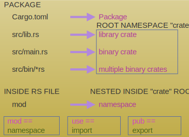

# Introduction

Code snippets and experiments for learning Rust.

# Packages and Modules (`Cargo.toml`)



- [Great SO answer about lib and bin crate namespaces](https://stackoverflow.com/a/57767413/2085356)

Here's the layout of the modules in this project, just repeating what is in `Cargo.toml`. The module
system is very similar to TypeScript namespaces.

1. There's a single `bin` binary crate (`main.rs`).

   - The namespace of this binary crate is `rust_example`.
   - The `[[bin]]` entry in `Cargo.toml` has this information.

2. There's a single `lib` library crate (`lib.rs`).

   - The namespace of this library is `rust_example_lib`. This is to avoid confusion w/ the name of
     the binary crate. The `[lib]` entry in `Cargo.toml` has this information.
   - While there may be multiple binary crates, there can only be max of 1 library crate.
   - There's really no need for this crate in this example. It is added to generate complexity to
     see how modules work. Instead of having this library crate, the code could have more simply
     been added to a `utils.rs`.

3. All the code that is written in this project (stored in separate `.rs` files) has to be
   "attached" to either the binary or library crate.

   - This is done via the the `mod` declaration in a `main.rs` or `lib.rs` file.

     1. If you prefix this declaration w/ `pub` then it will make this module public. This is kind
        of module re-exports in TypeScript.
     2. Otherwise it will be a private module, won't be visible externally. So in `lib.rs` if you
        write `mod color_text;` instead of `pub mod color_text;` then `color_text` module (loaded
        from `color_text.rs` which exports `mod color_text`) won't be available to other code for
        `use`.
     3. You can also take the code inside of `file.rs` and move it into `lib.rs` / `main.rs` and
        avoid the need for the `mod <file>` at the top of `lib.rs` / `main.rs`.

   - If one symbol is exported via `mod` in both the library and binary crate then there will be
     problems when importing them via `use`. Here's are examples of this kind of collision:

     1. `main.rs` has `mod guessing_game` which attaches the `guessing_game` module to the binary
        crate. In `lib.rs` if you add `mod guessing_game` then you will have attached this module to
        the library crate as well! And it won't be clear anymore which namespace to import this
        symbol (via `use`).
     2. In `main.rs` add `mod lib`. This will cause a collision w/ the code exported by `lib.rs`.

# Test snippets

[More info](https://doc.rust-lang.org/rust-by-example/testing/unit_testing.html)

## Single / inline

```rust
#[test]
fn test_something() {
  let tuple1: (i32, String) = (100, "123".to_string());
  let (number, text) = tuple1;
  assert_eq!(number, 100);
  assert_eq!(text, "123");
}
```

## Module

```rust
///
#[cfg(test)]
mod tests {
  use super::*;

  #[test]
  fn test_template() {}
}
```

# References

- [The Rust Programming Language book](https://doc.rust-lang.org/book/)
- [String, &String, &str](https://www.ameyalokare.com/rust/2017/10/12/rust-str-vs-String.html)
- [rust-ansi-term](https://github.com/ogham/rust-ansi-term)
- [std::fmt](https://doc.rust-lang.org/std/fmt/)
- [Primitive data types](https://learning-rust.github.io/docs/a8.primitive_data_types.html)
- [String <-> &str conversions](https://blog.mgattozzi.dev/how-do-i-str-string/)
- [String <-> &str conversions](https://stackoverflow.com/a/29026565/2085356)
- [Unwrap & expect, Result -> Ok, Err](https://learning-rust.github.io/docs/e4.unwrap_and_expect.html)
- [Rust turbofish](https://techblog.tonsser.com/posts/what-is-rusts-turbofish)
- [Unit testing](https://doc.rust-lang.org/rust-by-example/testing/unit_testing.html)
- [Error handling - array index out of bounds](https://users.rust-lang.org/t/array-out-of-bound-error-handling/26939)
- [Range and borrowing limitations, clone instead](https://stackoverflow.com/a/62480671/2085356)
- [Deref and Ref as different type](https://stackoverflow.com/a/41273331/2085356)
- [Roll your own typeof function](https://stackoverflow.com/a/58119924/2085356)
- [Rustfmt options](https://rust-lang.github.io/rustfmt/)

# Videos

- [Memory layout in Rust](https://youtu.be/rDoqT-a6UFg)
- [Rust Book](https://www.youtube.com/playlist?list=PLai5B987bZ9CoVR-QEIN9foz4QCJ0H2Y8)
